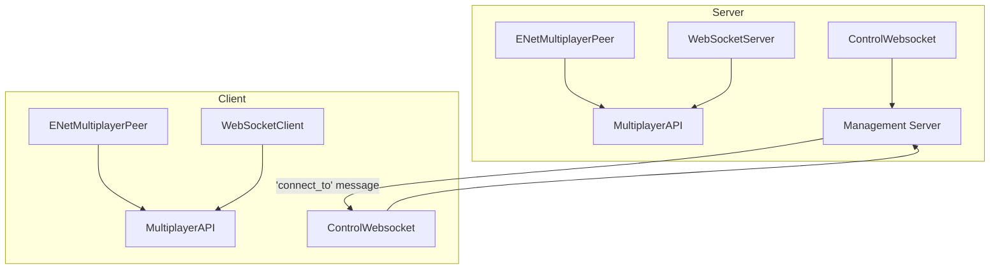

# Network Architecture (Dormant)

**Status**: Entirely commented out. No active networking code.

## Intended Architecture

Dual-backend multiplayer supporting both native (ENet) and web (WebSocket) clients:



## Key Components

| Component | File | Purpose |
|-----------|------|---------|
| Network | `src/network/Network.gd` | Server creation, client joining, backend selection |
| ControlWebsocket | `src/network/ControlWebsocket.gd` | Management server connection for orchestration |

## Backend Selection

```gdscript
enum { ENET, WEBSOCKETS }
var backend = WEBSOCKETS  # default
```

## Networking Patterns (coded but dormant)

- `@rpc("any_peer")` on `Game.load_scene`, `ShipManager.spawn_ship`, `Player.apply_input`
- Server-authoritative state sync with `RateLimiter`-throttled packets
- Input broadcasting: client → server → all clients
- Transform interpolation: `transform.interpolate_with(server_transform, weight)`
- Player registry synchronized via `player_registry_updated` RPC
- `FakeEvent.to_dict()`/`from_dict()` for serializing input across network

## What's Needed to Activate

1. Uncomment Network.gd and ControlWebsocket.gd
2. Uncomment RPC annotations on Game, ShipManager, Player
3. Implement server-side death handling, input broadcasting, waypoint broadcasting
4. Implement ChatBox integration (ChatBox UI exists, `Network.send_message` is commented out)
5. Implement Tanks and RocketPods weapon logic
6. Set up the management server (referenced in `server/main.py` + `venv.mk`)

See also: [system/autoloads.md](../system/autoloads.md) | [system/input.md](../system/input.md)
