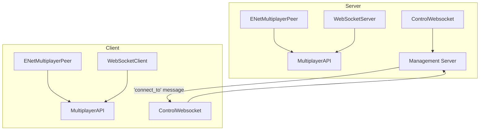

# Network Architecture (Dormant)

**Status**: Entirely commented out. No active networking code.

## Intended Architecture

Dual-backend multiplayer supporting both native (ENet) and web (WebSocket) clients:



## Key Components

| Component | File | Purpose |
|-----------|------|---------|
| Network | `src/network/Network.gd` | Server creation, client joining, backend selection |
| ControlWebsocket | `src/network/ControlWebsocket.gd` | Management server connection for orchestration |

## Backend Selection

```gdscript
enum { ENET, WEBSOCKETS }
var backend = WEBSOCKETS  # default
```

## Networking Patterns (coded but dormant)

- `@rpc("any_peer")` on `Game.load_scene`, `ShipManager.spawn_ship`, `Player.apply_input`
- Server-authoritative state sync with `RateLimiter`-throttled packets
- Input broadcasting: client → server → all clients
- Transform interpolation: `transform.interpolate_with(server_transform, weight)`
- Player registry synchronized via `player_registry_updated` RPC
- `FakeEvent.to_dict()`/`from_dict()` for serializing input across network

## What's Needed to Activate

1. Uncomment Network.gd and ControlWebsocket.gd
2. Uncomment RPC annotations on Game, ShipManager, Player
3. Implement server-side death handling, input broadcasting, waypoint broadcasting
4. Implement ChatBox integration (ChatBox UI exists, `Network.send_message` is commented out)
5. Implement Tanks and RocketPods weapon logic
6. Set up the management server (referenced in `server/main.py` + `venv.mk`)

## Open Architecture Questions

### Authority Model

PS2 uses client-authoritative — feels good to play but gives shooter's advantage and "ghost" problems (you die behind corners because others are shooting at where you were). Acceptable for massive casual battles.

Skyknights has max 12 players and is competitive. The tradeoff may be different:
- **Server-authoritative + client-side prediction**: standard competitive FPS model (CS:GO, Valorant). Client predicts own movement for responsiveness, server validates and corrects. Fair but can feel slightly laggy.
- **Client-authoritative**: feels better but unfair. Opponents shoot your ghost.
- **Hybrid**: client-authoritative for movement, server-authoritative for damage? Complex but possible.

The hover duel is the hardest sync problem — precise aim at a mostly-stationary target means even small desync is very noticeable. But hover duel state is also relatively easy to predict (small movements, predictable physics).

Big correction moments: terrain collision disagreement, afterburner/cap state disagreement, hit registration misses.

### EWAR and Per-Client Information

The RCS/sensor model means **every client should see a different minimap.** Two pilots in the same match have completely different radar pictures based on their sensor strength and enemy RCS. The server must:
- Maintain full RCS/sensor state for every ship
- Compute detection ranges per-client-per-target every tick
- **Never send position data for contacts a client shouldn't see** (anti-cheat — if the server sends it, a cheat can read it)
- Filter all world state per-recipient, not broadcast

This is the same problem Tribes solved with relevance-based world partitioning (see Tribes networking paper by Mark Frohnmayer / Tim Gift). EWAR detection is essentially a relevance filter with a continuous threshold instead of a binary distance cutoff.

### Information Partitioning

The Tribes paper on world partitioning and simulating what knowledge a client should have is directly applicable. Need to read and understand it before implementing. Key concepts: priority-based relevance scoring, ghost objects, region-based filtering. Maps onto Skyknights' EWAR/sensor system naturally.

### Anti-Cheat

Competitive game with information-based mechanics (EWAR, spotting, radar) means information security matters:
- Server must never send data the client shouldn't have
- Client-side radar hacks are prevented by server-side detection filtering
- Hit validation must be server-side
- Movement validation — detect impossible velocities/positions
- Replay system could help detect suspicious patterns

### Sync Precision Requirements

Hover duel demands tighter sync than most genres. Typical FPS tolerance (~100ms) is too loose. Need to determine acceptable tolerance for:
- Position sync (probably <50ms discrepancy)
- Hit registration (server-side validation within projectile travel time)
- Input relay (client→server→broadcast latency budget)

See also: [system/autoloads.md](../system/autoloads.md) | [system/input.md](../system/input.md) | [../plans/game-design.md](../plans/game-design.md)
