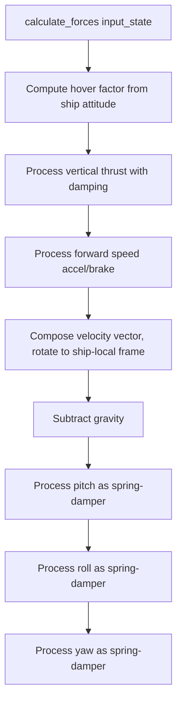

# Flight Physics — Engine Model

## Overview

`Engine.gd` implements a **spring-damper flight model**. Forces are calculated from `input_state`, producing velocity and angular rates applied by `BaseShip._physics_process()`.

## Data Structure

```gdscript
data = {
    velocity = Vector3(),
    gravity = 9.8,
    vert = {          # Vertical thrust
        hover = { current, target, force, max, response, damp },
        up    = { current, target, force, max, response, damp },
        down  = { current, target, force, max, response, damp },
    },
    speed = { current, target, accel, brake, max, response, damp },
    pitch = { input, target, current, force, max, response, damp },
    roll  = { input, target, current, force, max, response, damp },
    yaw   = { input, target, current, force, max, response, damp },
}
```

## Force Calculation Flow



Each axis follows the **spring-damper** pattern:
```
input → target → current (lerped via response + damp)
```

## Hover Factor

Reduced at steep ship attitudes — the ship loses lift when pointing sharply up/down. Computed from the ship's up-vector dot product with `Vector3.UP`.

## Modifier System

```gdscript
var modifiers = {}
var base_data = data.duplicate(true)  # backup

func add_modifier(name, modifier):
    modifiers[name] = modifier
    data = modifier.apply(data)

func remove_modifier(name):
    data = modifiers[name].remove_at(data)
    modifiers.erase(name)

func restore_data():
    data = base_data.duplicate(true)
```

The `Afterburner` modifier boosts `speed.accel`, `speed.max`, `vert.up.force`, and `vert.up.max`.

## Seats & Camera

`Seats.gd` auto-discovers child seat nodes, each containing `FirstPersonCamera` and `ThirdPersonCamera`.

- **FirstPersonCamera**: Yaw/pitch gimbal with limits (`yaw_limit`, `pitch_limit`), freelook support
- **ThirdPersonCamera**: Simple offset position behind the ship

See also: [summary.md](summary.md) | [marauder.md](marauder.md)
