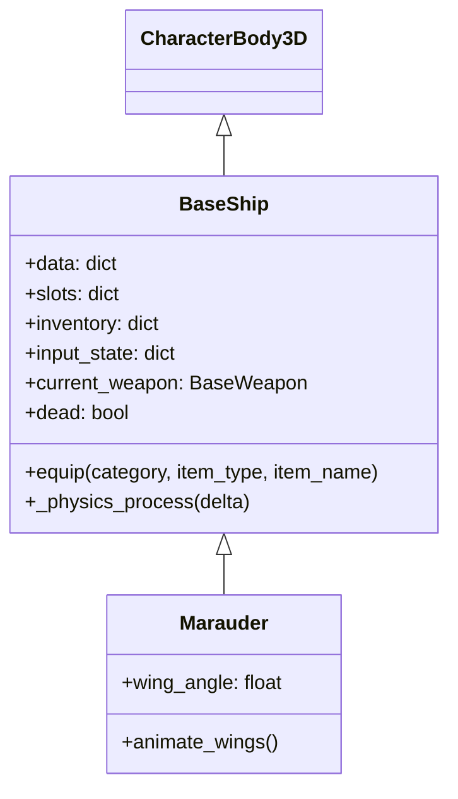

# Ship System

## Architecture

All ships extend `BaseShip.gd` (`CharacterBody3D`). The equip system uses a **slot/inventory** model.



## Equip System

```gdscript
# BaseShip.slots defines available loadout options
slots = { 'weapons': { 'nosegun': { 'colt': 'weapons/colt/Colt.tscn', ... }, ... } }

# equip() instantiates the scene and parents it
func equip(category, item_type, item_name):
    var item = load(ship_dir + slots[category][item_type][item_name]).instantiate()
    inventory[category][item_type] = item
    $Nosegun.add_child(item)  # or $Pylons
```

## Physics Loop

```gdscript
func _physics_process(delta):
    $Engine.calculate_forces(input_state)
    rotate_object_local(Vector3.RIGHT,   $Engine.data.pitch.current * delta)
    rotate_object_local(Vector3.UP,      $Engine.data.yaw.current * delta)
    rotate_object_local(Vector3.FORWARD, $Engine.data.roll.current * delta)
    set_velocity($Engine.data.velocity)
    move_and_slide()
    transform = transform.orthonormalized()
```

## Ship Scene Tree

```
Ship (Marauder)
  ├── Model/ (Chassis, Wings, Engines, Radar)
  ├── Health (component)
  ├── HealthBar (component)
  ├── Seats/0/
  │   ├── FirstPersonCamera/InnerGimbal/CameraPos
  │   └── ThirdPersonCamera/CameraPos
  ├── Engine
  ├── Afterburner
  ├── Nosegun/ (Colt or Vortek)
  └── Pylons/ (Tanks or RocketPods)
```

## Spawn Flow

`ShipManager.spawn_ship(player_id, data)` creates ships into `/root/Main/Ships/`. Ships are named by player ID.

See also: [marauder.md](marauder.md) | [weapons.md](weapons.md) | [flight-physics.md](flight-physics.md)
