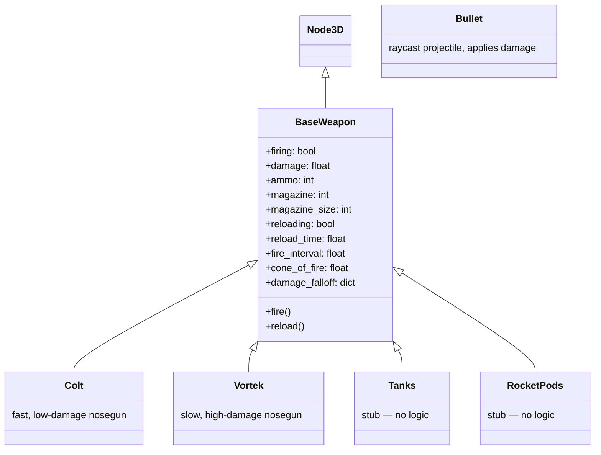

# Weapon System

## Architecture

## BaseWeapon Behavior

- **Firing**: When `firing == true` and not reloading and magazine > 0, spawns a `Bullet` at fire interval
- **Reload**: Triggered manually or when magazine empties; blocks firing for `reload_time` seconds
- **Cone of fire**: Random spread added to bullet direction
- **Damage falloff**: Ranges with damage multipliers (e.g., `{ 'close': { 'range': 50, 'multiplier': 1.0 }, 'far': { 'range': 200, 'multiplier': 0.5 } }`)

## Bullet

Raycast-based projectile. On `_physics_process`, casts a ray from current to next position. On hit, calls `body.do_damage(damage)` on the collider. If no hit within lifetime, bullet is freed.

## Nosegun Variants

| Weapon | Fire Rate | Damage | Magazine | Description |
|--------|-----------|--------|----------|-------------|
| Colt   | Fast      | Low    | Higher   | Rapid-fire low-caliber |
| Vortek | Slow      | High   | Lower    | Slow heavy-hitter |

## Pylon Weapons (Stubs)

- **Tanks** — equipped but no firing logic
- **RocketPods** — equipped but no firing logic

See also: [marauder.md](marauder.md) | [summary.md](summary.md)
