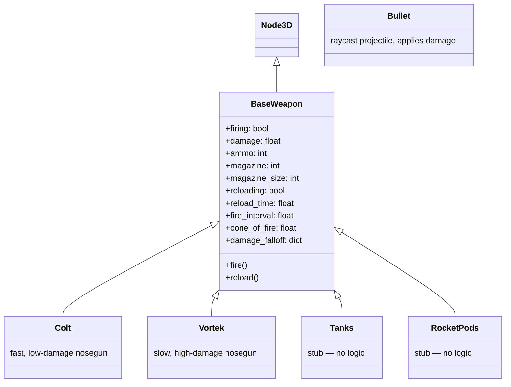

# Weapon System

## Design Direction (see [plans/game-design.md](../../plans/game-design.md) for full detail)

All weapons are **physics-based ballistic** — military aircraft aesthetic, no energy weapons. Every weapon has velocity, travel time, and physical projectiles. The only cap-interacting weapon is the railgun (charge mechanic).

**Noseguns** = sustained damage (always cycling, ammo-based). **Pylons** = burst/conditional damage (finite ammo, bigger moment).

## Current Implementation

### Architecture

### BaseWeapon Behavior

- **Firing**: When `firing == true` and not reloading and magazine > 0, spawns a `Bullet` at fire interval
- **Reload**: Triggered manually or when magazine empties; blocks firing for `reload_time` seconds
- **Cone of fire**: Random spread added to bullet direction
- **Damage falloff**: Ranges with damage multipliers (e.g., `{ 'close': { 'range': 50, 'multiplier': 1.0 }, 'far': { 'range': 200, 'multiplier': 0.5 } }`)

### Bullet

Raycast-based projectile. On `_physics_process`, casts a ray from current to next position. On hit, calls `body.do_damage(damage)` on the collider. If no hit within lifetime, bullet is freed.

### Implemented Noseguns

| Weapon | Fire Rate | Damage | Magazine | Description |
|--------|-----------|--------|----------|-------------|
| Colt   | Fast      | Low    | Higher   | Rapid-fire low-caliber |
| Vortek | Slow      | High   | Lower    | Slow heavy-hitter |

### Pylon Weapons (Stubs — No Logic)

- **Tanks** — equipped but no firing logic
- **RocketPods** — equipped but no firing logic

## Planned Expansion

### Pylon Weapon Roster

| Weapon | Velocity | Damage | Ammo | Role |
|--------|----------|--------|------|------|
| Rocket pods | Moderate | Moderate | Good count | Generalist air+ground |
| A2A missiles | Moderate + tracking | Low per hit | 4-6 | Air pressure tool; force hover breaks, finish runners |
| A2G missiles | Slow | High | Limited | MOBA specialist; anti-tank, anti-AAA, anti-static |
| Railgun | Very high | Very high | 2-3 | Precision; charge-from-cap, mind game in hover duel |

### Lock-On Missile Design Constraints

- Limited ammo (4-6, never 20)
- Lock acquisition requires soft-aim (keep crosshair near target ~1.5s, not "hold still while circle fills")
- Lock breaks on hard maneuver or countermeasures
- Pylon opportunity cost: bringing A2A means NOT bringing A2G, rockets, or railgun

### Railgun Charge Mechanic

Instead of reload, the railgun charges from capacitor:
- Start charging → cap drains → committed but haven't fired
- Visual/audio indicator warns enemy (mind game: both players decide during charge window)
- Can release early (less damage, conserve cap), hold full charge, or cancel/bluff
- Self-balancing through cap economy: large railgun needs space to charge, possibly teammate support
- Fitting synergy: wants aux capacitor (mod bay) + stability airframe

See also: [marauder.md](marauder.md) | [summary.md](summary.md) | [../../plans/game-design.md](../../plans/game-design.md)
