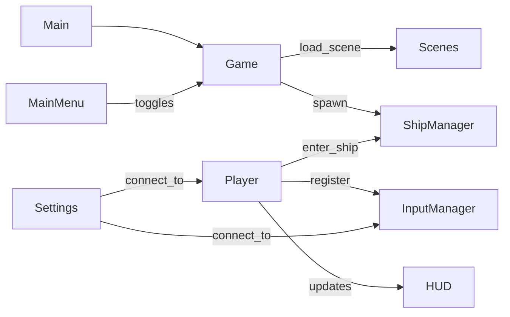

# Autoload Registry & Interaction Flow

## Autoloads (load order from project.godot)

| # | Name | Source | Type | Purpose |
|---|------|--------|------|---------|
| 1 | Stopwatch | `src/system/Stopwatch.gd` | Node (tool) | Timing/profiling utility |
| 2 | Utils | `src/system/Utils.gd` | Node | General utilities (mostly dormant) |
| 3 | Files | `src/system/Files.gd` | Node (tool) | JSON file I/O abstraction |
| 4 | Args | `src/system/Args.gd` | Node | CLI argument parser |
| 5 | Settings | `src/ui/settings/Settings.tscn` | TabContainer | Persistent settings system |
| 6 | InputManager | `src/system/InputManager.gd` | Node | Custom input action system |
| 7 | Game | `src/system/Game.gd` | Node | Core game state, scene/level management |
| 8 | Player | `src/player/Player.tscn` | Node3D | Player controller (camera, ship entry, input relay) |
| 9 | MainMenu | `src/ui/MainMenu.tscn` | CanvasLayer | Pause/settings menu overlay |
| 10 | HUD | `src/ui/hud/HUD.tscn` | CanvasLayer | In-game HUD overlay |
| 11 | Scenes | `src/system/Scenes.gd` | Node | Scene name-to-path registry |
| 12 | ShipManager | `src/system/ShipManager.gd` | Node | Ship spawning, avatar management |

## Core Interaction Flow



## Runtime Scene Tree

```
/root
  /Main (src/Main.tscn)
    /World (loaded level container)
    /Players
    /Ships/{player_id}
    /Bullets
    /CanvasLayer (UI layer host)
  /Stopwatch, /Utils, /Files, /Args, /Settings, /InputManager, /Game,
  /Player, /MainMenu, /HUD, /Scenes, /ShipManager (autoloads)
```

See also: [input.md](input.md) | [scenes.md](scenes.md) | [../ui/summary.md](../ui/summary.md)
