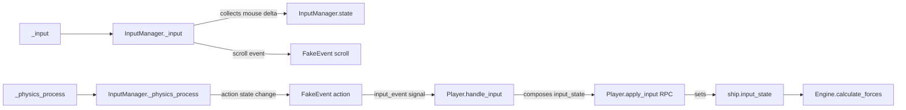

# Input System

## Pipeline



## InputManager

Autoload that detects action state changes and emits `FakeEvent` signals.

- **`state` dict**: Tracks current pressed/released state of all registered actions
- **`register(object)`**: Connects `input_event` signal to `object.handle_input`
- **Mouse delta**: Collected in `_input`, consumed by Player for pitch/yaw
- **Scroll**: Synthesized as FakeEvent for weapon/throttle control

## FakeEvent

```gdscript
class_name FakeEvent
var action = ''
var pressed = false
func to_dict(): return { 'action': action, 'pressed': pressed }
func from_dict(dict): action = dict.action; pressed = dict.pressed; return self
```

Lightweight `RefCounted` object. Serializable for network transmission.

## Player Input State

Player composes a flat `input_state` dict each physics frame:
```gdscript
input_state['fire_primary'] = InputManager.state['fire_primary'] and capture_mouse
input_state['pitch'] = pitch    # from mouse delta
input_state['roll'] = roll
input_state['yaw'] = yaw
input_state['afterburner'] = ...
# etc.
```

## Player Input Handling

`Player.handle_input(event)` routes FakeEvents to:
- Toggle first/third person camera
- Toggle main menu
- Toggle freelook
- Switch seats
- Toggle minimap/map

See also: [autoloads.md](autoloads.md) | [../ships/flight-physics.md](../ships/flight-physics.md)
